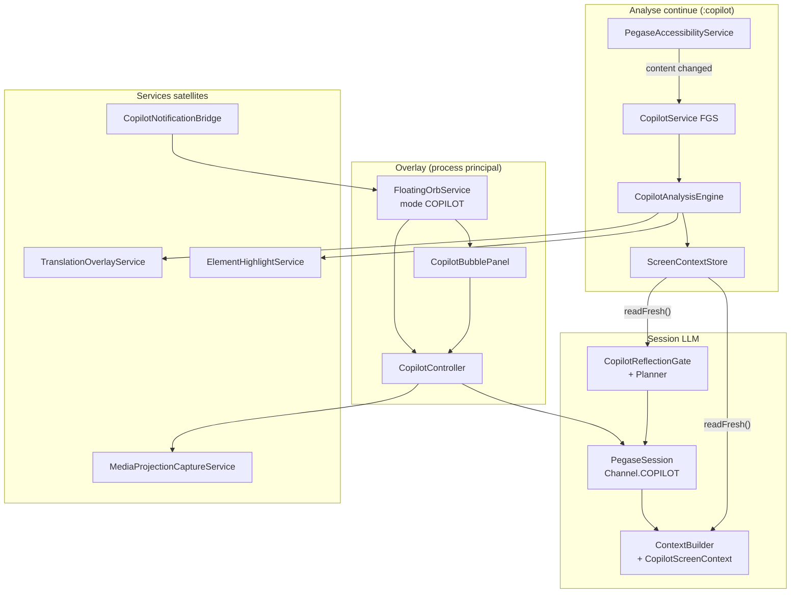

# Mode copilote Pégase — État actuel

**Dernière mise à jour :** 31 juillet 2026  
**Branche de référence :** `cursor/v3-p6-location-drive-14e9` (PR [#17](https://github.com/Arknoid01/pegase/pull/17))  
**Package :** `com.pegasuscorp.orbe.copilot` (+ satellites voix, outils, overlay)

---

## Résumé

Le **mode copilote** est un assistant contextuel permanent par-dessus les autres applications Android. Il combine :

- une **orbe flottante** discrète (56 dp) avec **bulle messenger** ;
- une **analyse d'écran locale** (accessibilité + OCR) sur **liste blanche stricte** ;
- un canal LLM dédié (`Channel.COPILOT`) avec injection de contexte écran (P2) et planification cachée (P3) ;
- des **actions locales** (sous-titres YouTube, traduction overlay, surlignage, notifications) ;
- une **capture écran + vision** à la demande (cloud) ;
- une **ingestion texte** (Share Intent, presse-papiers, voix).

Le copilote est **livré et fonctionnel** depuis la Phase 5 v2 (mergé sur `main`). La branche v3 P2–P6 y ajoute le contexte écran LLM, la réflexion cachée, l'intégration mode DRIVE auto, et des réglages avancés.

---

## Vue d'ensemble architecture



---

## Entrées utilisateur

| Entrée | Chemin | Fichier / composant |
|--------|--------|---------------------|
| Réglages copilote | Pégase → Outils → **Mode copilote** | `CopilotSettingsActivity` |
| Picker apps custom | Réglages → « Ajouter une app » | `CopilotAppPickerActivity` |
| Orbe au boot / pause | Hors MainActivity, si `always_on` | `PrefetchBootReceiver`, `LifecycleBridge` |
| Notif importante | Orbe affichée + message bulle | `CopilotNotificationBridge` |
| Partage texte | Partager → Pégase | `ShareIngestActivity` |
| Voix | « active les sous-titres », « retiens ça »… | `CopilotIntentHandler` |
| Localisation / conduite | Tiroir perso → Localisation & conduite | `SituationSettingsActivity` (impact orbe auto-drive) |

---

## Overlay — orbe et bulle

### `FloatingOrbService` (dual-mode VOICE / COPILOT)

| Aspect | Détail |
|--------|--------|
| Taille orbe copilote | 56 dp (`COPILOT_ORB_PX`) |
| Bulle | 300×380 dp + orbe, position mémorisée |
| Tap orbe | Ouvre / ferme la bulle messenger |
| Long-press | Menu : bulle, ouvrir Pégase, activer/désactiver orbe |
| Drag | Repositionnement → `CopilotPrefs.setOrbPosition()` |
| Masquage | Sur `MainActivity` / `PegaseInterfaceActivity` ; réapparaît ailleurs |
| FGS | Notification « Copilote actif — tap l'orbe pour discuter » |

**Démarrage copilote :** `FloatingOrbService.showCopilot(ctx)` — conditions :

1. `CopilotPrefs.isAlwaysOn()` (défaut : `true`)
2. Permission `SYSTEM_ALERT_WINDOW`
3. **Pas** en auto-conduite active (`PegaseModeStore.isAutoDriveActive()`)

### `CopilotBubblePanel`

- Messages utilisateur / assistant (streaming partiel)
- Statuts : capture, analyse, réflexion, erreurs
- Actions rapides : **Écran** (vision), **Retenir** (mémoire), **Ouvrir Pégase**
- Confirmations outils Oui/Non inline
- Message de bienvenue au premier affichage
- État `sending` synchronisé avec `CopilotController.isSending()`

### `CopilotController`

Pont unique bulle ↔ `PegaseSession` :

| Méthode | Rôle |
|---------|------|
| `attach(BubbleSink)` | Init canal `COPILOT`, enregistre receivers notif + statut |
| `detach()` | Nettoie receivers, reset `sending`, wake thinking off |
| `sendUserMessage(text)` | Tour utilisateur → réflexion éventuelle → `session.send()` |
| `captureAndAnalyze(prompt)` | MediaProjection → `OpenRouterVisionClient` → réponse bulle |
| `rememberFromScreen()` | Vision → `MemoryRepository.addPermanentMemory()` |
| `isSending()` | Garde anti double-envoi |

**Receivers :**

- `CopilotNotificationBridge.ACTION_IMPORTANT_NOTIF` → message `📩` résumé dans la bulle
- `CopilotStatusBridge.ACTION_STATUS` → erreurs service copilote

---

## Canal session LLM

### `Channel.COPILOT`

- Session initialisée à chaque `attach()` : `PegaseSession.init(SessionContext(Channel.COPILOT, false))`
- Historique de conversation distinct des autres canaux
- Outils disponibles : `copilot_action`, `screen_capture`, outils globaux Pégase

### Injection contexte écran (P2 v3)

**Fichiers :** `CopilotScreenContext`, `ScreenContextStore`, `ContextBuilder.appendCopilotScreenContext()`

Flux :

1. `PegaseAccessibilityService` détecte changement de contenu (app whitelistée)
2. `CopilotAnalysisEngine` extrait texte (a11y, OCR fallback) → `ScreenContextStore.update()`
3. À chaque tour copilote, `CopilotScreenContext.readFresh()` vérifie :
   - analyse écran activée ;
   - package dans whitelist ;
   - texte non vide ;
   - âge ≤ `CopilotPrefs.getScreenMaxAgeMs()` (défaut 45 s, réglable 10–300 s) ;
   - taille ≤ `CopilotPrefs.getScreenMaxChars()` (défaut 2000, réglable 200–8000)
4. Si valide → bloc `--- Écran actif (copilote, local) ---` injecté dans le system prompt **uniquement** sur `Channel.COPILOT`

> Le texte vient de l'accessibilité/OCR local — **pas d'image** envoyée au LLM pour le contexte continu.

### Réflexion cachée (P3 v3)

**Fichiers :** `CopilotReflectionGate`, `CopilotReflectionPlanner`, `PegaseSession.completeCopilotReflectionSync()`

Déclenchement heuristique local (`needsReflection`) si :

- réflexion activée (`CopilotPrefs.isReflectionEnabled()`, défaut `true`) ;
- snapshot écran frais disponible ;
- message assez long (≥ 8 car.) ;
- et au moins un signal : action (« clique », « traduis »…), multi-étapes (« ensuite », « puis »…), question sur l'écran (« que faire sur cet écran »), décision (« dois-je »).

Pipeline :

1. Thread IO `REFLECTION_IO` — appel éphémère `completeCopilotReflectionSync()` (canal `TEXT`, hors historique, max 350 tokens)
2. Plan interne préfixé `[Plan interne — ne pas répéter à l'utilisateur]`
3. Envoi tour visible sur main thread avec `attachGeneration` pour éviter courses à la détache

**Corrections récentes :** pas de double injection écran (réflexion sur `Channel.TEXT`), `send` toujours sur main, `isSending()` bloque les envois parallèles.

---

## Analyse d'écran continue

### Process `:copilot`

| Composant | Rôle |
|-----------|------|
| `CopilotService` | FGS dédié, écoute `SCREEN_ON`/`SCREEN_OFF`, binder AIDL |
| `CopilotClient` | IPC launcher ↔ `:copilot` (pattern `VoiceWakeClient`) |
| `ICopilotService.aidl` | `sync()`, `getLastText()`, callbacks |
| `CopilotAnalysisEngine` | Pipeline analyse sur changement de contenu |

### `PegaseAccessibilityService`

- Config : `res/xml/pegase_accessibility_config.xml`
- Événements : `TYPE_WINDOW_CONTENT_CHANGED`, `TYPE_WINDOW_STATE_CHANGED`
- Debounce : 280 ms
- Notifie `CopilotClient.notifyContentChanged(pkg)` si whitelist OK
- Action locale hardcodée : `YouTubeSubtitleAction` (bouton CC)

### Règles strictes

| Règle | Implémentation |
|-------|----------------|
| Liste blanche vide par défaut | `CopilotPrefs.getWhitelist()` |
| Aucune analyse hors whitelist | `isPackageAllowed()` partout |
| Écran éteint → suspendu | `CopilotService` + `engine.setScreenOn(false)` |
| Priorité a11y > OCR | `A11yTreeExtractor` puis `OcrFallback` (ML Kit) |
| Snapshot partagé | `files/copilot/a11y_snapshot.json` |

### `ScreenContextStore`

- Dernier package, texte, timestamp (SharedPreferences)
- Consommé par `CopilotScreenContext`, traduction, surlignage

---

## Services satellites

### Traduction overlay (`TranslationOverlayService`)

```
a11y snapshot (texte + bounds JSON)
  → CopilotLocaleFilter (filtre langue locale)
  → blocs étrangers détectés
  → CopilotCloudBridge (IPC :copilot → main)
  → CopilotTranslator (cloud : texte seul, format N|traduction)
  → labels positionnés aux coords left/top
```

- Toggle : `CopilotPrefs.isTranslationOverlayEnabled()` (défaut `true`)
- Auto-masquage après ~12 s
- Cloud ne reçoit **que le texte**, pas l'image ni les positions

### Surlignage éléments (`ElementHighlightService`)

- Toggle : `CopilotPrefs.isElementHighlightEnabled()` (défaut `false`)
- Cadres sur éléments cliquables (bounds a11y)
- Debounce 4 s, max 12 rectangles
- `BoundsOverlayHelper` pour le rendu

### Notifications ciblées

| Fichier | Rôle |
|---------|------|
| `CopilotNotificationFilter` | Whitelist séparée, pas group summary, contenu non vide |
| `CopilotNotificationBridge` | Broadcast + `showCopilot()` |
| `CopilotNotificationSummarizer` | Phrase Pégase (« Marine t'a écrit : … ») |
| `PegaseNotificationListenerService` | Point d'entrée `onNotificationPosted` |

- Toggle : `CopilotPrefs.isNotificationCopilotEnabled()` (défaut `false`)
- Whitelist notifs distincte de l'analyse écran (`notif_whitelist`)

### Capture écran + vision

| Fichier | Rôle |
|---------|------|
| `ScreenCaptureHelper` | MediaProjection, permission flow |
| `ScreenCapturePermissionActivity` | Consentement one-shot |
| `MediaProjectionCaptureService` | FGS Android 14+ |
| `OpenRouterVisionClient.analyzeJpegBytes()` | Analyse cloud JPEG |
| `ScreenCaptureTool` | Outil LLM `screen_capture` |

Usages : bouton **Écran** bulle, **Retenir**, ou outil session.

### Share Intent + presse-papiers

| Fichier | Rôle |
|---------|------|
| `ShareIngestActivity` | `ACTION_SEND text/plain` |
| `ShareIngestRouter` | Mémoire permanente ou contexte nommé (`.md`) |

Commandes vocales via `CopilotIntentHandler` :

- « retiens ça » → `MemoryRepository`
- « ajoute ça à Orion » → `ContextualFileStore`

---

## Actions locales et outils LLM

### `CopilotActionTool` + `YouTubeSubtitleAction`

- Outil `copilot_action` avec `action: youtube_subtitles`
- Déclenché par voix (« Pégase, active les sous-titres ») ou LLM
- 100 % local via Accessibility Service — pas de LLM pour le clic

### `CopilotIntentHandler`

- Détection phrases sous-titres YouTube
- Routage ingestion texte (`ShareIngestRouter`)

---

## Préférences (`CopilotPrefs` — `copilot_prefs`)

| Clé | Défaut | Description |
|-----|--------|-------------|
| `always_on` | `true` | Orbe copilote toujours visible hors Orbe |
| `orb_x`, `orb_y` | `-1` | Position mémorisée |
| `bubble_open` | `false` | État bulle au redémarrage service |
| `app_whitelist` | vide | Apps autorisées pour analyse écran |
| `screen_analysis` | `false` | Master toggle analyse continue |
| `translation_overlay` | `true` | Overlay traduction |
| `notif_copilot` | `false` | Alertes notifications |
| `notif_whitelist` | vide | Apps notifs autorisées |
| `element_highlight` | `false` | Surlignage éléments cliquables |
| `reflection_enabled` | `true` | Planification cachée P3 |
| `screen_max_age_sec` | `45` | Fraîcheur max snapshot (10–300 s) |
| `screen_max_chars` | `2000` | Taille max texte écran (200–8000) |

Helper : `enableYouTubeCopilot()` — active YouTube + analyse (premier cas d'usage).

---

## UI réglages (`CopilotSettingsActivity`)

### Section générale

- Orbe toujours visible
- Analyse d'écran
- Overlay traduction
- Surlignage éléments
- Alertes notifications

### Section avancée (P2/P3 v3)

- Réflexion cachée (toggle)
- Fraîcheur max snapshot (secondes)
- Taille max texte écran (caractères)

### Permissions (liens système + statut ✓/✗)

- Afficher par-dessus les apps
- Service d'accessibilité Pégase
- Accès aux notifications
- Capture écran (MediaProjection)

### Listes blanches

**Presets :** YouTube, Chrome, Firefox, Gmail, WhatsApp, Messages, Telegram, Slack  
+ picker toute app installée (`CopilotAppPickerActivity`)  
Sections séparées : analyse écran / notifications

---

## Intégrations v3 (hors package copilot)

### Mode DRIVE auto (P6)

| Composant | Interaction copilote |
|-----------|---------------------|
| `LocationSituationTracker` | Vitesse GPS → `PegaseModeStore.enterAutoDrive(DRIVE)` |
| `LocationSituationPrefs.hideCopilotOnAutoDrive` | Défaut `true` → `FloatingOrbService.hide()` à l'entrée |
| `FloatingOrbService.showCopilot()` | Bloqué si `isAutoDriveActive()` |
| `PegaseModeStore.exitAutoDrive()` | Restaure le mode précédent à la sortie auto-drive |
| `SituationSettingsActivity` | Toggle masquage orbe, seuils vitesse, lieux |

Le contexte lieu (maison, travail, restaurant) est injecté via `SituationPromptBuilder` / `ContextBuilder` — **canal global**, pas spécifique copilote, mais utile en conduite.

### Hub visuel (P5)

- `PegaseVisualStateHub` / `PegaseVisualPhase` — état orbe unifié HOME / overlay / Discussion
- Le copilote consomme les phases visuelles via `FloatingOrbService` / `MiniOrbView`

### Wake (P4)

- `CopilotController.setSending()` → `PegaseWakeController.setAssistantThinking()`
- Pause wake si discussion texte active hors session chat

---

## Manifest Android

Déclarations sous `app/src/main/AndroidManifest.xml` :

| Composant | Process | Notes |
|-----------|---------|-------|
| `ShareIngestActivity` | main | Intent filter `SEND text/plain` |
| `PegaseAccessibilityService` | main | Label « Pégase copilote » |
| `CopilotService` | `:copilot` | FGS `copilot_screen_analysis` |
| `TranslationOverlayService` | main | FGS `copilot_translation_overlay` |
| `ElementHighlightService` | main | FGS `copilot_element_highlight` |
| `CopilotSettingsActivity` | main | Label « Mode copilote » |
| `CopilotAppPickerActivity` | main | Picker apps |
| `MediaProjectionCaptureService` | main | Capture Android 14+ |
| `ScreenCapturePermissionActivity` | main | Consentement capture |

---

## Tests unitaires

```bash
./gradlew :app:testDebugUnitTest --tests "com.pegasuscorp.orbe.copilot.*"
./gradlew :app:testDebugUnitTest --tests "com.pegasuscorp.orbe.memory.ContextBuilderCopilotScreenTest"
./gradlew :app:testDebugUnitTest --tests "com.pegasuscorp.orbe.voice.handlers.CopilotIntentHandlerTest"
```

| Test | Couverture |
|------|------------|
| `CopilotPrefsTest` | always_on, whitelist, position orbe |
| `CopilotScreenContextTest` | readFresh, filtrage âge/chars/whitelist |
| `CopilotReflectionGateTest` | heuristiques déclenchement réflexion |
| `CopilotReflectionPlannerTest` | format prompt / payload prefix |
| `ContextBuilderCopilotScreenTest` | injection canal COPILOT uniquement |
| `CopilotAnalysisEngineTest` | parse contexte, remember, parseContextName |
| `CopilotLocaleFilterTest` | détection langue par bloc |
| `CopilotTranslatorTest` | parse `N\|traduction` |
| `CopilotNotificationFilterTest` | filtrage whitelist notifs |
| `CopilotNotificationSummarizerTest` | format phrase Pégase |
| `OcrFallbackTest` | fallback OCR |
| `CopilotIntentHandlerTest` | phrases sous-titres YouTube |

---

## Arborescence fichiers

```
app/src/main/java/com/pegasuscorp/orbe/copilot/
├── AccessibilityAccess.java          # Helper réglages a11y
├── A11ySnapshot.java                 # Modèle nodes (texte + bounds)
├── A11yTreeExtractor.java            # Extraction arbre a11y → JSON
├── BoundsOverlayHelper.java          # Rendu overlays positionnés
├── CopilotAnalysisEngine.java        # Pipeline analyse continue
├── CopilotAppPickerActivity.java     # Picker apps installées
├── CopilotBubblePanel.java           # UI bulle messenger
├── CopilotClient.java                # Client IPC → :copilot
├── CopilotCloudBridge.java           # Pont traduction main ↔ :copilot
├── CopilotController.java            # Pont bulle ↔ PegaseSession
├── CopilotLocaleFilter.java          # Filtre langue locale
├── CopilotNotificationBridge.java    # Broadcast notifs → orbe
├── CopilotNotificationFilter.java    # Filtre notifs whitelist
├── CopilotNotificationSummarizer.java
├── CopilotPrefs.java                 # Préférences copilote
├── CopilotReflectionGate.java        # Heuristique réflexion P3
├── CopilotReflectionPlanner.java     # Prompt plan interne P3
├── CopilotScreenContext.java         # Snapshot frais → LLM P2
├── CopilotService.java               # FGS process :copilot
├── CopilotSettingsActivity.java      # Écran réglages
├── CopilotStatusBridge.java          # Erreurs service → bulle
├── CopilotTranslator.java            # Appel LLM traduction
├── ElementHighlightService.java      # Surlignage bounds
├── MediaProjectionCaptureService.java
├── OcrFallback.java                  # ML Kit text-recognition
├── PegaseAccessibilityService.java   # Service a11y principal
├── ScreenCaptureHelper.java
├── ScreenCapturePermissionActivity.java
├── ScreenContextStore.java           # Store texte écran local
├── ScreenTextExtractor.java
├── ShareIngestActivity.java
├── ShareIngestRouter.java
├── TranslationOverlayService.java
└── apps/
    └── YouTubeSubtitleAction.java    # Action locale YouTube CC

app/src/main/java/com/pegasuscorp/orbe/tools/copilot/
└── CopilotActionTool.java            # Outil LLM copilot_action

app/src/main/java/com/pegasuscorp/orbe/voice/handlers/
└── CopilotIntentHandler.java         # Intentions vocales copilote

app/src/main/aidl/.../copilot/
├── ICopilotService.aidl
└── ICopilotCallback.aidl

app/src/main/res/values/
└── strings_copilot.xml               # Chaînes UI copilote
```

**Intégrations liées (hors package) :**

- `FloatingOrbService.java` — dual-mode VOICE/COPILOT
- `memory/ContextBuilder.java` — injection écran P2
- `session/Channel.java`, `session/PegaseSession.java` — canal + réflexion P3
- `intentions/location/*` — auto-drive, masquage orbe P6
- `intentions/PegaseModeStore.java` — mode DRIVE
- `PegaseNotificationListenerService.java` — notifs
- `prefetch/PrefetchBootReceiver.java` — boot orbe
- `session/LifecycleBridge.java` — pause → showCopilot

---

## Dépendances

```gradle
implementation 'com.google.mlkit:text-recognition:16.0.1'  // OCR fallback copilote
```

Cloud (vision + traduction) : clé API OpenRouter configurée côté app.

---

## Principes produit respectés

| Principe | Statut |
|----------|--------|
| Liste blanche stricte (pas d'analyse par défaut) | ✅ |
| Maximum local (a11y, OCR, filtres, actions YouTube) | ✅ |
| Cloud = texte utile seulement (traduction, vision à la demande) | ✅ |
| Process `:copilot` isolé et tuable | ✅ |
| SCREEN_OFF suspend l'analyse | ✅ |
| Pas d'image envoyée pour le contexte écran continu | ✅ |
| Confirmations outils dans la bulle | ✅ |
| Orbe masquée sur l'app Pégase | ✅ |

---

## Limites connues / hors scope

- **Pas de contrôle UI générique** (clics arbitraires) — seul YouTube CC est hardcodé
- **Traduction** : heuristique langue, pas de détection locale ML avancée
- **Vision** : nécessite consentement MediaProjection à chaque session (selon OEM)
- **Réflexion** : heuristique regex — faux positifs/négatifs possibles
- **Auto-drive** : basé GPS vitesse ; pas de détection Android Auto native
- **Tests device** : smoke automatisé PASS (v2) ; checks visuels YouTube/Chrome/WhatsApp restent manuels

---

## Documents historiques

| Fichier | Contenu |
|---------|---------|
| `docs/copilot-done.md` | Récap livraison Phase 5 v2 |
| `docs/copilot-phase5-session.md` | Spec détaillée + plan tests device |
| `docs/copilot-polish-checklist.md` | Checklist polish PR #9 |

Ce document (`copilot-etat.md`) est la **référence consolidée** incluant les évolutions v3 P2–P6.

---

## Checklist smoke test rapide

1. Activer permissions (overlay, a11y, notifs si besoin, capture)
2. Quitter Orbe → orbe 56 dp visible
3. Tap → bulle, envoyer message → réponse LLM
4. Activer YouTube en whitelist → ouvrir vidéo → « active les sous-titres »
5. Chrome EN → traductions overlay positionnées
6. WhatsApp notif (whitelist) → phrase dans bulle
7. Bouton Écran → description vision
8. Partager texte → Pégase → mémoire
9. Réglages avancés : désactiver réflexion, ajuster fraîcheur snapshot
10. Conduite auto (vitesse) → orbe masquée si option activée
