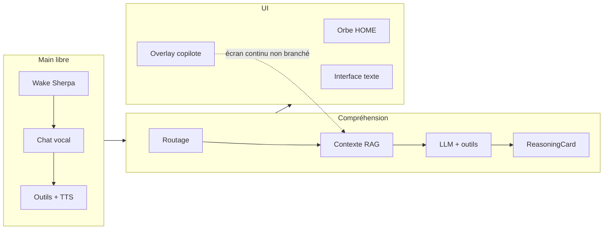

# Pégase v3 — Audit : main libre, compréhension, UI

**Repo :** [Arknoid01/pegase](https://github.com/Arknoid01/pegase)  
**Date :** 31 juillet 2026  
**Base :** `main` post-v2 (copilote, mémoire, personnalité, wake Sherpa)  
**Objectif :** documenter **ce que Pégase possède déjà** sur trois axes avant de planifier une v3 « plus poussée, sans complexité ajoutée ».

Ce document est un **état des lieux**, pas un cahier des charges. Les pistes v3 en fin de section sont des axes de discussion, pas des engagements.

---

## Synthèse en une page

| Pilier | Forces actuelles | Limite principale |
|--------|------------------|-------------------|
| **Main libre** | Wake « Pégase », chat vocal continu, ~9 domaines d’intentions vocales, TTS Piper/Android, confirmations oui/non à la voix | Tout commence par un geste ou un réglage ; hors launcher, pas d’assistant vocal dans l’app en cours |
| **Compréhension** | Routage lexical + apprentissage vocal, RAG local, agentique 2 hops, cartes de raisonnement, copilote a11y/OCR | Pas de chaîne de pensée ; l’écran continu n’alimente pas le chat ; compréhension = retrieval + regex + LLM |
| **UI** | Orbe vivante, interface 5 onglets, overlay copilote, surlignage a11y, tokens visuels unifiés | Copilote et réglages sont tactiles ; confirmations texte ≠ confirmations vocales |



---

## 1. Mode main libre

*Pouvoir agir sans toucher l’interface — ou avec le minimum de setup initial.*

### 1.1 Ce qui existe

#### Réveil et entrée en session vocale

| Élément | Détail |
|---------|--------|
| Wake word local | Sherpa-ONNX, process `:voice`, mot « Pégase » + variantes (`pegasse`, `pegaze`, `hey pegase`…) |
| Service dédié | `VoiceService` — FGS micro discret, routage BT SCO / casque / téléphone (`KwsAudioRouteManager`) |
| Activation | **Désactivée par défaut** — toggle Personnalisation → « Activer l’écoute Pégase » |
| Déclenchement | Détection KWS → `VoiceWakeClient` → `MainActivity` (`wake_activate`) → `VoiceInputHandler.enterChatMode()` |
| Vérification locuteur | Option « Dis Pégase pour confirmer » (`SpeakerVerifyGate`) si empreinte vocale enrôlée |

**Fichiers :** `voice/VoiceService.java`, `SherpaKwsEngine.java`, `VoiceWakeClient.java`, `PegaseWakeStore.java`, `PegaseWakeController.java`

#### Chat vocal continu (cœur mains libres)

Une fois en mode discussion vocale :

1. STT Google (`fr-FR`) capture la phrase  
2. `VoiceIntentRouter` tente un routage direct vers un outil  
3. Sinon → `PegaseSession.send()` (LLM + outils agentiques)  
4. Réponse TTS (Piper local prioritaire, sinon Android)  
5. Micro se rouvre automatiquement (`scheduleListeningResume`, ~400 ms après la parole)

**Entrées possibles en chat vocal :**

| Entrée | Comment |
|--------|---------|
| Wake word | « Pégase » (depuis l’accueil ou autre app → ramène le launcher) |
| Long-press orbe | Geste tactile initial sur l’orbe HOME |
| Phrase vocale | « mode discussion », « discuter » (hors chat actif) |

**Sortie vocale :** « au revoir », « stop », « quitte le mode »

**Fichiers :** `voice/VoiceInputHandler.java`, `VoiceManager.java`, `SpeechOutput.java`, `conversation/ResponseDelivery.java`

#### Routage d’intentions (sans LLM quand possible)

Ordre de résolution dans `VoiceIntentRouter` :

1. Phrases apprises (`VoiceIntentLearnStore`) — avec confirmation / désambiguïsation  
2. Éditeurs notepad / corrections → LLM  
3. Chaîne de handlers (premier match gagne) :

| Handler | Exemples vocaux |
|---------|-----------------|
| `CopilotIntentHandler` | « retiens ça », sous-titres YouTube |
| `LifeIntentHandler` | Agenda, brief matin, routines, mémoire |
| `DiagIntentHandler` | Diagnostics, trace |
| `OrionIntentHandler` | Pods GPU / ComfyUI |
| `KnowledgeIntentHandler` | Météo, actus, F1, recherche web |
| `MediaIntentHandler` | Spotify, YouTube, NASA APOD |
| `SystemIntentHandler` | Calcul, lampe, **navigation** (Maps/Waze), appels, minuteurs, alarmes, volume, Wi‑Fi/BT, notifications, fichiers, presse-papiers, contacts, réglages |
| `BureauIntentHandler` | **Stub vide** — pas de commandes bureau à la voix |

**Confirmations mains libres :** `VoiceConfirmation` — oui / non / annule entièrement à la voix.

**Parser launcher (niveau 1) :** `LocalKeywordParser` — ouvrir app, bureau, tiroir, minuteur, interface.

**Fichiers :** `voice/VoiceIntentRouter.java`, `voice/handlers/*.java`, `voice/VoiceConfirmation.java`

#### Coordination micro (une seule source à la fois)

`PegaseWakeController` définit qui a le droit d’écouter :

| État | Wake | Micro partagé | Input principal |
|------|------|---------------|-----------------|
| Accueil idle | ✅ | ❌ | Touch + wake |
| Chat vocal actif | ❌ | ✅ | Voix |
| Discussion texte (interface) | ❌ | ❌ | Clavier |
| Bureau ouvert | ❌ | PTT uniquement | Doigt + micro par appui |
| Micro coupé global | ❌ | ❌ | Touch seul |

**Fichiers :** `voice/PegaseWakeController.java`, `chat/ChatVoiceBridge.java`

#### Retour vocal et modes de présence

| Capacité | Détail |
|----------|--------|
| TTS streaming | Réponse lue pendant la génération LLM |
| Formatage oral | `SpeechFormatter`, `PegasePrompt.sanitizeForSpeech()` |
| Mode conduite / travail | `PegaseModeStore` — réponses plus courtes (DRIVE) |
| Mode doux wake | Sessions STT plus espacées, moins de lag UI |
| Pause média | Wake suspendu si musique/vidéo active (`MediaPlaybackGuard`) |
| Écran verrouillé | Discussion OK ; **outils système bloqués** (`LockSessionPolicy`) |

#### Overlay et copilote (partiellement mains libres)

| Capacité | Mains libres ? |
|----------|----------------|
| Orbe flottante pendant chat vocal | Tap → ramène MainActivity ; pas de commande vocale sur l’orbe |
| Bulle copilote | **Texte seulement** — pas de micro dans la bulle |
| Notifs whitelistées → bulle | Automatique, passif |
| Sous-titres YouTube | Voix + service accessibilité activé |
| « Retiens ça » (presse-papiers / écran) | Voix en session chat |

**Fichiers :** `FloatingOrbService.java`, `copilot/CopilotBubblePanel.java`, `copilot/CopilotController.java`, `copilot/PegaseAccessibilityService.java`

#### Bureau (explicitement non main libre)

- Push-to-talk : un appui = une écoute (`BureauMic.java`)  
- Pas de dictée continue sur le canvas  
- Wake coupé tant que le bureau est ouvert  

---

### 1.2 Matrice : sans toucher vs tactile requis

#### Faisable sans toucher (après configuration initiale)

- Dire « Pégase » et converser en boucle vocale  
- Poser des questions → LLM + TTS  
- Déclencher outils système (alarme, nav, appel, météo, Spotify…) en chat vocal, téléphone déverrouillé  
- Confirmer / annuler une action à la voix  
- Quitter le chat à la voix  
- Activer sous-titres YouTube (a11y + whitelist)  
- Mémoriser du texte (« retiens ça »)  
- Recevoir des résumés de notifs dans la bulle copilote (lecture visuelle, pas TTS bulle)

#### Nécessite le tactile (ou setup one-shot)

- Activer wake, accessibilité, overlay, permissions micro  
- Entrer en chat sans wake (long-press orbe)  
- Bureau : dessin, PTT, projets visuels  
- Bulle copilote : saisie, boutons Écran / Retenir / Ouvrir Pégase  
- Gestes HOME : tiroir apps, bureau (double-tap), discussion texte (tap phase), slots raccourcis  
- Capture écran copilote (consentement MediaProjection)  
- Personnalisation complète (couleurs, clés API, modèles…)  
- Choisir une app dans le tiroir  
- Outils système sur écran verrouillé  

---

### 1.3 Limites structurelles (main libre)

1. **Pas d’assistant vocal in-app** — le wake ramène toujours `MainActivity` ; dans Chrome/WhatsApp/etc., seul l’orbe copilote texte est disponible.  
2. **KWS fragile** — modèle anglais pour mot français ; pas de fallback STT en arrière-plan si KWS tombe.  
3. **STT = Google** — chat vocal nécessite le réseau pour la reconnaissance (hors wake Sherpa).  
4. **Amorce tactile** — long-press orbe si wake désactivé ou en échec.  
5. **Copilote sans voix** — overlay = messagerie texte, pas extension mains libres du chat principal.  
6. **BureauIntentHandler vide** — le bureau n’est pas pilotable à la voix.  

---

### 1.4 Pistes v3 (discussion — pas de spec)

Axes cohérents avec « améliorer sans complexifier » :

- Brancher l’orbe overlay sur le **même micro** que le chat vocal (PTT ou écoute courte)  
- **Wake in-place** : réponse TTS sans forcer le retour au launcher (option ou mode conduite)  
- Unifier confirmations vocales quand l’interface texte est ouverte  
- Compléter `BureauIntentHandler` avec 3–4 commandes utiles (ouvrir note, dicter titre…)  
- Fiabiliser KWS + indicateur clair « j’écoute / je ne écoute pas »  

---

## 2. Compréhension — réflexion, analyse, déduction

*Ce que Pégase « comprend » avant et pendant de répondre — hors simple echo LLM.*

### 2.1 Architecture actuelle (couches)

Pégase n’a pas de moteur de compréhension unique. L’intelligence est **empilée** :

```
Entrée (voix / texte / copilote)
    → Routage déterministe (regex, apprentissage, handlers)
    → Analyse de contexte (ContextAnalyzer — lexical, pas LLM)
    → Injection mémoire / profil / atlas / résumé session (RAG)
    → LLM + function calling (max 2 hops agentiques)
    → Carte de raisonnement + garde anti-hallucination
    → Réponse (TTS ou bulle)
```

**Hub central :** `session/PegaseSession.java`

---

### 2.2 Ce qui existe par couche

#### A. Routage et « compréhension » immédiate (sans LLM)

| Mécanisme | Rôle | Fichiers |
|-----------|------|----------|
| `VoiceIntentRouter` | 9 handlers + phrases apprises + confirmations | `voice/VoiceIntentRouter.java` |
| `ContextAnalyzer` | Intent lexical, filtre d’outils autorisés, budget contexte | `memory/ContextAnalyzer.java` |
| `IntentDetector` | Labels : `fresh_data`, `music`, `diag`, `orion`, `philosophical`… | `memory/IntentDetector.java` |
| `UserExamplesStore` | Exemples utilisateur → override routage tracé | mémoire / routing |
| `VoiceIntentLearnStore` | Enseignement vocal de phrases → outils | `voice/VoiceIntentLearnStore.java` |
| `EntityResolver` | Lien entités → atlas, seed mémoire | `memory/EntityResolver.java` |
| `VoicePhraseClarity` | Fallback phrases vagues | `voice/VoicePhraseClarity.java` |

**Nature :** matching lexical et règles — pas d’inférence sémantique profonde.

#### B. Contexte et mémoire (ce qu’elle « sait » sur toi)

| Mécanisme | Rôle | Fichiers |
|-----------|------|----------|
| RAG local | MiniLM-L6 ONNX, 384-dim, scoring mot-clé + cosine + graphe | `rag/EmbeddingEngine.java`, `memory/MemoryScorer.java` |
| Mémoires permanentes | JSON + retrieval 2–3 snippets / tour | `memory/MemoryRepository.java` |
| Historique chat | 6 derniers tours + 2 pertinents par mots-clés | `memory/ConversationHistorySelector.java` |
| Résumé session | JSON LLM à la sortie discussion → « contexte récent » | `memory/SessionSummarizer.java` |
| Profil / atlas | Entités liées, sections profil injectées | `memory/ContextBuilder.java` |
| Contextes nommés | Fichiers `.md` attachés on-demand | `contextstore/ContextualFileStore.java` |
| Consolidation | Session → mémoires, vitalité, décroissance | `memory/MemoryConsolidator.java` |

**Nature :** retrieval + ranking — pas de modèle du monde ni de déduction explicite.

#### C. Prompts et personnalité (comment elle raisonne *dans* le LLM)

| Élément | Contenu |
|---------|---------|
| `pegase-personality.md` | Ton, blacklist, few-shots — éditable sur device |
| `PegasePrompt` | Règles opérationnelles, correction STT, modes conduite/travail |
| `PersonalityGuide` | Injection personnalité dans system prompt |
| `MemoryPromptBuilder` | Assemblage system complet + consignes synthèse agentique |
| Blocs situationnels | WiFi, patterns vie, candidats apprentissage, humeur | `learning/`, `life/`, `conversation/` |

**Choix produit explicite :** les prompts **interdisent** le raisonnement visible :

> « Réponds directement, sans raisonnement interne, sans balise thinking. »

Qwen : `reasoning_format: "hidden"`. Local GGUF : `/no_think`.

**Conséquence :** pas de chaîne de pensée utilisateur ; réponses rapides et orales.

#### D. Agentique et outils (action + synthèse)

| Mécanisme | Limite |
|-----------|--------|
| `AgenticChain` | Tool call → résultat → synthèse LLM |
| `AgenticTurnPolicy` | **Max 2 outils par tour** |
| `ToolSuccessHint` | Messages système pour guider la synthèse |
| Registry outils | Alarme, nav, mémoire, notepad, capture écran, copilot_action… |

**Nature :** planification implicite dans le LLM, bornée à 2 étapes — pas de planner général.

#### E. Transparence post-hoc (pas réflexion en direct)

| Élément | Ce que ça montre |
|---------|------------------|
| `ReasoningCard` | Intent, outils, mémoires, sources, latence |
| `HallucinationDetector` | Affirmations passé sans source RAG/outil |
| `ReasoningTurnCollector` | Collecte par tour pour l’UI 🔍 (Discussion) |

**Nature :** audit « qu’est-ce qui a été utilisé ? » — pas « pourquoi ai-je pensé ça ? ».

#### F. Compréhension de l’écran (copilote)

| Pipeline | Continu / à la demande | Branché au chat ? |
|----------|------------------------|-------------------|
| Arbre accessibilité | Continu (apps whitelistées) | ❌ |
| OCR fallback | Si arbre &lt; 2 nœuds | ❌ |
| `ScreenContextStore` | Texte écran + package + timestamp | ❌ **non injecté** dans `PegaseSession` |
| Capture + vision cloud | Bouton « Écran » bulle | ✅ via `lastScreenContext` dans `CopilotController` |
| Surlignage éléments | Auto 8 s | Visuel seulement |
| Traduction overlay | Blocs langue étrangère | Visuel + cloud |

**Gap majeur :** l’analyse continue de l’écran et la conversation sont **déconnectées**. Seule une capture manuelle alimente le LLM copilote.

**Fichiers :** `copilot/CopilotAnalysisEngine.java`, `A11yTreeExtractor.java`, `OcrFallback.java`, `CopilotController.java`, `chat/OpenRouterVisionClient.java`

#### G. Orion (raisonnement structuré — domaine code uniquement)

| Pattern | Usage |
|---------|-------|
| `PromptCompiler` | Sandwich mission + snippet + QA |
| `TaskComplexityEstimator`, `PlanBuilder` | Tâches code multi-étapes |
| `OrionQaChecker` | Vérification sortie |

**Non généralisé** au chat vocal / discussion générale.

#### H. Intentions proactives (compréhension situationnelle passive)

`IntentionEvaluator` — règles capteurs (batterie, WiFi travail, brief, calendrier, F1, Bluetooth voiture…) → **notifications**, pas dialogue.

Alimente le prompt situationnel ; ne répond pas à « qu’est-ce que tu comprends de ma situation ? » de façon unifiée.

---

### 2.3 Ce que « compréhension » veut dire aujourd’hui

| Capacité | Niveau actuel |
|----------|---------------|
| Comprendre une commande outil claire | ✅ Bon (regex + apprentissage) |
| Comprendre une question ouverte | ⚠️ LLM + RAG limité (2–3 souvenirs) |
| Déduire implicitement (non dit) | ⚠️ Dépend du modèle cloud, non contrôlé |
| Analyser l’écran en continu | ⚠️ Pipeline existe, **non connecté** au cerveau |
| Réfléchir avant de répondre (visible ou caché) | ❌ Explicitement désactivé |
| Auto-critique / revérification | ⚠️ `HallucinationDetector` post-réponse seulement |
| Expliquer pourquoi elle a répondu X | ⚠️ ReasoningCard = sources, pas raisonnement |
| Planifier plusieurs étapes (hors Orion) | ⚠️ 2 hops max |

---

### 2.4 Pistes v3 (discussion)

Sans ajouter de nouveaux sous-systèmes :

- **Pont perception** — injecter `ScreenContextStore` (fraîcheur + package) dans `ContextBuilder` quand copilote actif  
- **Réflexion ciblée** — passe planification cachée *uniquement* pour intents complexes (pas partout)  
- **ReasoningCard enrichie** — « souvenir rappelé parce que… » (`MemoryScorer` breakdown)  
- **Fusion multimodale légère** — a11y texte + dernière capture vision = un seul bloc contexte  
- **Étendre agentique** — 2→3 hops seulement si intent `fresh_data` ou multi-outil détecté  
- **Routeur sémantique léger** — embedding match avant explosion regex (réutiliser RAG existant)  

---

## 3. UI

*Ce que l’utilisateur voit, touche, et ce que la voix peut piloter côté interface.*

### 3.1 Surfaces principales

| Surface | Rôle | Input dominant |
|---------|------|----------------|
| **HOME** (`MainActivity`) | Orbe, fond fluide, tiroir apps, encre | Touch + wake |
| **Interface Pégase** (`PegaseInterfaceActivity`) | 5 onglets : Discussion, Notepad, Outils, Orion, Fichiers | Texte / touch |
| **Overlay orbe** (`FloatingOrbService`) | Chat vocal (grand) ou copilote (discret) | Touch |
| **Bulle copilote** (`CopilotBubblePanel`) | Messagerie + actions écran | Texte |
| **Overlays système** | Surlignage a11y, traduction | Passif / auto |

**Design tokens :** `ui/OrbeTokens.java` — fond `#0B0E14`, accent cyan `#35D0DD`  
**Thèmes orbe :** 5 palettes (`OrbThemes.java`) — Cyan, Émeraude, Azur, Améthyste, Corail

---

### 3.2 HOME — orbe et gestes

**Composant :** `OrbView.java` + `OrbUiController.java`

**États visuels :**

| État | Feedback |
|------|----------|
| Idle | Pulse, halo, sparkles, horloge, phase du jour |
| Écoute | `setListening(true)` |
| Réflexion | Arc « thinking », ailes déployées en chat vocal |
| Ring raccourcis | Apps assignables (`ShortcutStore`) |

**Gestes (tous tactiles) :**

| Geste | Action |
|-------|--------|
| Tap orbe (délai) | Déployer ring raccourcis |
| Double-tap | Bureau |
| Triple-tap | Widget board |
| Long-press | Chat vocal |
| Swipe up | Tiroir apps |
| Tap label phase | Discussion **texte** |
| Trait encre | Reconnaissance lettre → filtre apps |

**Hints :** `GestureHintsStore` — 3 retours HOME max (« Appui long → voix », etc.)

**Fond :** `FluidBackgroundView` (phases jour/soir/nuit), wallpaper, voile accent, animation charge.

---

### 3.3 Interface Discussion (texte)

**Fichier :** `iface/DiscussionFragment.java`

| Élément UI | Détail |
|------------|--------|
| Fil conversation | `RecyclerView` + adaptateur |
| `ThinkingView` | Progression outil / LLM |
| Bannière mémoire | Tap → portrait ; long-press expand |
| Pièces jointes | Image, PDF, markdown |
| Confirmations outils | Bulle question — **réponse par frappe clavier** (`PendingToolConfirm`) |

**Comportement :** ouverture onglet → wake coupé, micro partagé bloqué.

---

### 3.4 Personnalisation

**Fichier :** `PersonalizationPanel.java` — overlay depuis tiroir (engrenage)

Sections : Apparence, Launcher, Cerveau (LLM), Voix (wake, Piper, règles STT), Mémoire, Services, Diagnostic.

**100 % tactile** — aucune navigation vocale dans le panneau.

---

### 3.5 Copilote — UI overlay

| Composant | Taille / comportement |
|-----------|----------------------|
| Orbe `VOICE` | 160 dp — retour chat |
| Orbe `COPILOT` | 56 dp discret — toggle bulle |
| Bulle | 300×380 dp — input, chips Écran / Retenir / Pégase, Oui/Non |
| Surlignage | Rectangles cyan, max 12, 8 s (`ElementHighlightService`) |
| Traduction | Overlay blocs (`TranslationOverlayService`) |

**Position orbe :** draggable, persistée (`CopilotPrefs`).

---

### 3.6 Feedback multisensoriel

| Canal | Usage |
|-------|-------|
| TTS | Réponses chat, confirmations, accueil wake |
| Visuel orbe | Écoute, réflexion, pulse copilote actif |
| Toast | Erreurs, progression, toggles |
| Notifications | FGS overlay, import notifs copilote |
| Haptique | `PegaseSheets.haptic()` — onglets, bannière mémoire |
| ReasoningCard 🔍 | Discussion — transparence post-réponse |

**Pas de :** indicateur d’écoute unifié hors HOME ; annonce vocale des surlignages ; design TalkBack-first.

---

### 3.7 Matrice voix vs touch (UI)

| Zone | Voix | Touch |
|------|------|-------|
| HOME chat vocal | ✅ Complet | Gestes d’entrée |
| Interface Discussion | ❌ Wake coupé | ✅ Clavier + menus |
| Bulle copilote | ❌ | ✅ Texte + chips |
| Personnalisation | ❌ | ✅ Tout |
| Confirmations outils (texte) | ❌ | ✅ Frappe oui/non |
| Confirmations outils (voix) | ✅ | — |
| Réglages copilote | ❌ | ✅ Whitelist, permissions |
| Orbe overlay menu | ❌ | ✅ Long-press PopupMenu |

---

### 3.8 Pistes v3 (discussion)

- **Parité confirmations** — même flux oui/non vocal quand Discussion est ouverte  
- **Micro sur orbe copilote** — réutiliser `VoiceManager` sans nouvelle stack  
- **Indicateur d’écoute global** — chip ou pulse synchronisé HOME / overlay / interface  
- **Hints vocaux** — « dis “aide gestes” » en complément des whispers tactiles  
- **ReasoningCard en voix** — option « explique » → TTS du résumé carte  
- **Tokens unifiés** — rapprocher `OrbThemes` et `OrbeTokens` pour une identité plus cohérente  

---

## 4. Couplages entre les trois piliers

Où les axes se renforcent ou se bloquent mutuellement :

| Interaction | État actuel | Friction |
|-------------|-------------|----------|
| Wake → UI | Ramène HOME, déploie ailes, TTS accueil | Quitte l’app en cours |
| Voix → Compréhension | Routage riche en chat vocal | Interface texte bypass le routage vocal optimisé |
| Compréhension → UI | ReasoningCard en texte seulement | Pas de retour vocal sur l’analyse |
| Copilote → Compréhension | Vision manuelle seulement | Écran continu ignoré par le LLM |
| Copilote → Main libre | Bulle texte | Overlay ne prolonge pas les mains libres |
| UI → Main libre | Gestes d’entrée obligatoires | Pas de découverte vocale des surfaces |

---

## 5. Inventaire fichiers clés

```
# Main libre
voice/VoiceInputHandler.java      # Orchestrateur chat vocal
voice/VoiceIntentRouter.java      # Routage intentions
voice/VoiceService.java           # Wake KWS
voice/PegaseWakeController.java   # États micro
voice/handlers/*.java             # Intentions par domaine
FloatingOrbService.java           # Overlay

# Compréhension
session/PegaseSession.java        # Hub conversationnel
memory/ContextAnalyzer.java       # Intent + outils
memory/ContextBuilder.java        # Injection RAG
llm/PegasePrompt.java             # System instructions
diag/ReasoningCard.java           # Transparence
copilot/CopilotAnalysisEngine.java # Perception écran
chat/AgenticChain.java            # Boucle outils

# UI
MainActivity.java / OrbView.java
iface/DiscussionFragment.java
PersonalizationPanel.java
copilot/CopilotBubblePanel.java
ui/OrbeTokens.java / OrbThemes.java
```

---

## 6. Pour la suite (v3)

Ce audit pose la question : **où gagner le plus sans empiler de nouveaux modules ?**

| Priorité suggérée | Pilier | Idée |
|-------------------|--------|------|
| 1 | Main libre + UI | Micro / confirmations sur overlay et interface texte |
| 2 | Compréhension | Brancher l’écran continu déjà capturé vers `ContextBuilder` |
| 3 | Compréhension | Réflexion ciblée (cachée) sur intents complexes seulement |
| 4 | Main libre | Wake fiable + indicateur « j’écoute » |
| 5 | UI | Feedback écoute/réflexion unifié HOME ↔ overlay |

**Hors scope volontaire ici :** nouveaux modules (planner général, nouveau moteur STT, refonte PegaseSession).

---

*Document généré pour préparation v3 — à valider ensemble avant roadmap détaillée.*

**Suite :** programme validé → [`v3-plan-consolide.md`](./v3-plan-consolide.md)
